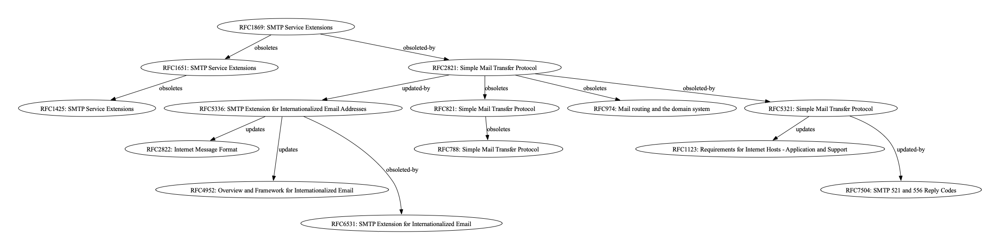

# RFSee

A tool for visualizing the dependency graph of an RFC document.

## Install

```sh
pip install rfsee
```

## Example

To visualize dependencies of 'RFC 1869: SMTP Service Extensions'.

```sh
rfsee -n 1869
```

Will produce the following graph:



This project bundles an `index.xml` metadata file that was last updated on 2026-05-10. If this is insufficient, then you can grab a fresh copy from https://www.rfc-editor.org/rfc-index.xml and use the `--rfc-index` option.

```sh
rfsee --help
Usage: rfsee [OPTIONS]

Options:
  -n, --rfc-number INTEGER  The RFC number to graph e.g. 5321  [required]
  -i, --rfc-index TEXT      Use an RFC index.xml file from disk. Defaults to a
                            pre-packed index file. Get a new copy from
                            https://www.rfc-editor.org/rfc-index.xml
  -o, --output TEXT         Where to output the graph. Default: rfsee.dot
  --dont-open               Don't automatically open the generated graph.
  --max-depth INTEGER       Maximum dependency exploration depth. Default: 3
  --help                    Show this message and exit.
```


